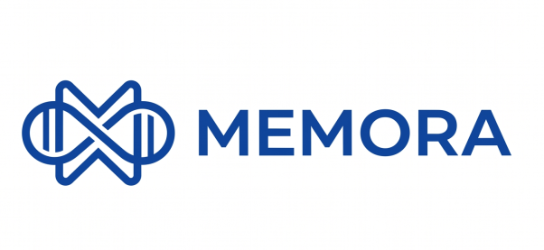

# Memora




## Overview

Memora is a modern web application built using a robust monorepo architecture. This repository contains both the frontend and backend applications, along with shared core packages to ensure type safety and code reusability across the stack.

## Project Structure

The project is structured as a monorepo workspace to easily manage dependencies and scripts across both the frontend client and backend API.

```text
memora/
├── back-end/       # Elysia API backend
├── front-end/      # SvelteKit frontend application
├── packages/
│   └── core/       # Shared business logic & types
└── package.json    # Monorepo root
```
